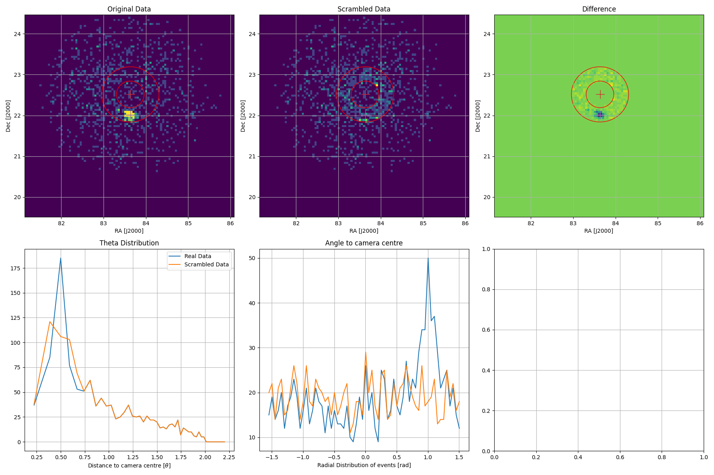
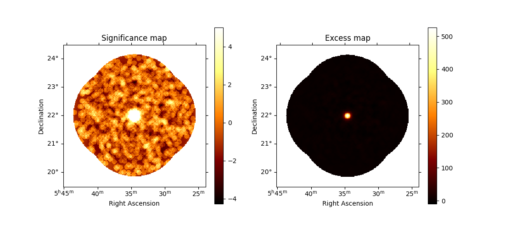
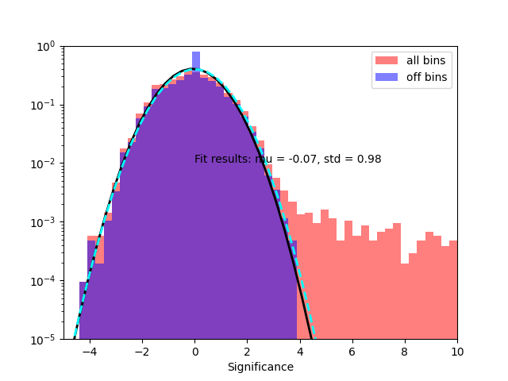
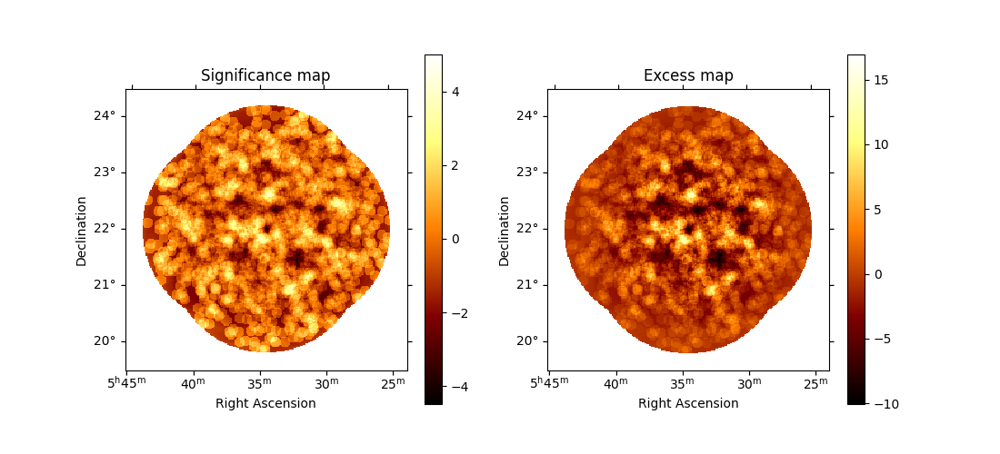
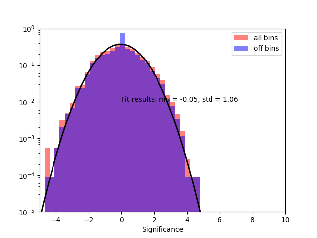

# Mimicing and Scrambling Dataset

"Mimicing" data is when a background run is modified such that it appears to be an observations taken on a FoV of interest.

To first order mimicing simply involves converting the coordinates of events in background run to the coordinates of the FoV of interest. This is is handled by the [`LocationFaker`](background_from_bkg/fake_source_coordinates/fake_location.py) class.


To do this we require two DL3 files for `target` and `faked` observations. The `target` is the real observation that we'd like to investigate for possible systematic effects. The `faked` observation is a background run that closely resembles the observing conditions of the `target` observation. Given two runs we can generate mimiced data using the following:

```python
from background_from_bkg.fake_source_coordinates import LocationFaker


# Two exisiting observatiosn
target_obs = "input/12345.fits"
faked_obs = "background/98765.fits"

output_obs = "mimic/12345.fits"

my_faker = LocationFaker()

my_faker.convert_fov(target_obs, fake_obs, output_obs)
```

In the above the run `98765.fits` will have its events converted into the FoV of `12345.fits`. The converted events will be saved to `mimic/12345.fits`.

If `98765.fits` was an observation containing a weak gamma-ray source ( $\lesssim 2\sigma$ e.g. non-flaring blazar), we can "scramble" the events coincident with the known source into the background.

```python
from astropy.coordinates import SkyCoord

...
my_faker = LocationFaker()

known_sources = [
    SkyCoord.from_name("1ES 1218+304"),
    SkyCoord.from_name("1ES 1215+303"),
]

my_faker.convert_fov(target_obs, fake_obs, output_obs, scramble_point = known_sources, scramble_theta = 0.3 )

```

This will scramble the events around two known VHE sources. Events within an annulus region of $r_{mid}$ equal to the distance between the source and camera centre and $r_{outer} - r_{inner} = 2\times$`scramble_theta`, will have their RA/Dec randomly scrambled. The radial acceptance is approximated, excluding events within `scramble_theta` of the source of interest. The radial distance to the camera centre is weighted by the approximate radial acceptance to ensure the scambling maintains the radial response.


If we wanted to explicitly test a background of one run on another FoV, we can copy the background when mimicing the data:

```python
target_obs = "input/12345.fits"
faked_obs = "background/98765.fits"
output_obs = "mimic/12345.fits"
output_obs_background = "mimic_with_same_background/12345.fits"

my_faker = LocationFaker()

my_faker.convert_fov(target_obs, fake_obs, output_obs)
my_faker.convert_fov(target_obs, fake_obs, output_obs_background, copy_background = True)

```

In the above `mimic/12345.fits` with contain the background from run `background/98765.fits` while `mimic_with_same_background/12345.fits`  with contain the background from run `input/12345.fits`.


## Example of Scrambled Crab data

Here is an example of scrambling Crab obseravtions. This is for display purposes, scrambling a source as bright as the Crab will most certainly introduce systematic effects.



* Top Left: 2D histogram of events, original data
* Top Middle: 2D histogram of events, scrambled data
* Top Right: 2D histogram of events, original - scrambled data
* Bottom Left: Theta distribution of events
* Bottom Middle: Azimuthal distribution of events

The annulus region is shown in red.


Example sky maps of unscrambled data:




Example sky maps of scrambled data:

